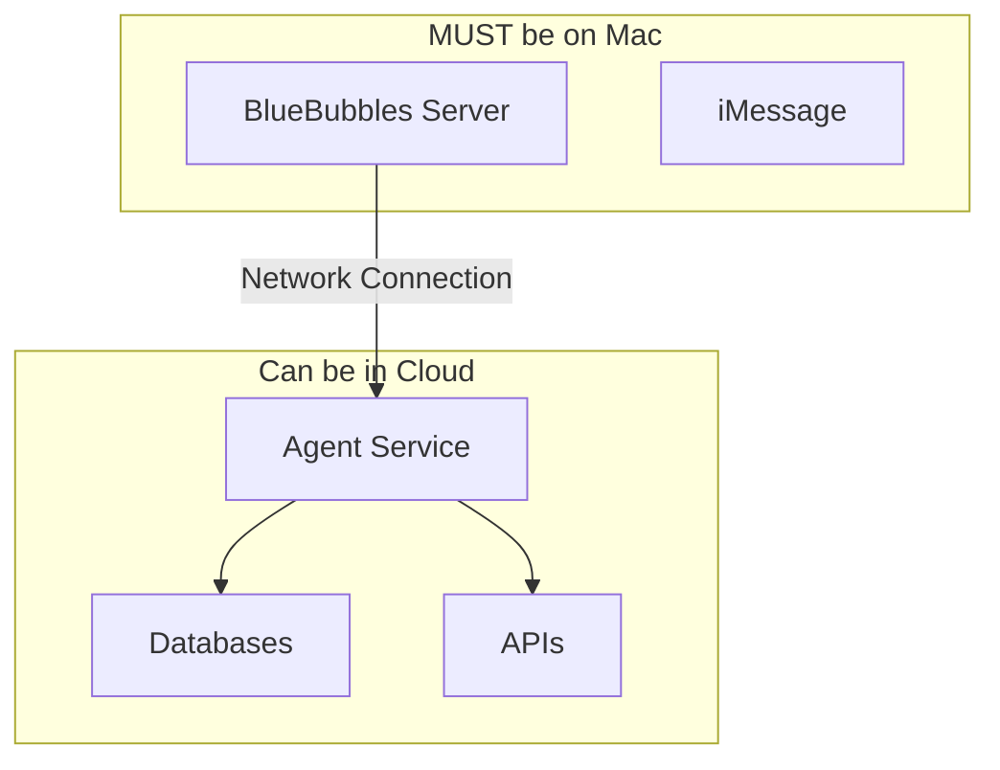

# Complexity Analysis & Architecture Review

## ✅ Key Decisions Confirmed

### 1. **Repository Approach: FORK (not clone)**
- Fork BlueBubbles-Server and bluebubbles-app via GitHub web interface
- This allows you to make custom modifications
- Can still pull updates from upstream

### 2. **Authentication: Direct OAuth 2.0 (not Auth0)**
- Implement Google OAuth directly
- Full control, no third-party dependency
- Slightly more complex but well-documented

### 3. **Backend Hosting: DigitalOcean + Local Mac**
- **DigitalOcean**: For cloud components (~$50/month)
- **Your Mac**: For BlueBubbles Server (must run on macOS)
- **NOT using**: Vercel/Netlify (incompatible with persistent connections)

## 🔴 Complex Parts (Need Extra Attention)

### 1. **BlueBubbles ↔ Cloud Connection** ⚠️ MOST COMPLEX
**Why Complex:**
- BlueBubbles MUST run on Mac (can't be cloud-hosted)
- Need stable connection between Mac and cloud services
- Network setup (ngrok/port forwarding)
- Handling disconnections/reconnections

**Solution Approach:**
```typescript
// Implement robust reconnection logic
class BlueBubblesConnection {
  private reconnectAttempts = 0;
  private maxReconnectDelay = 60000;
  
  async connect() {
    try {
      await this.socket.connect();
    } catch (error) {
      await this.handleReconnect();
    }
  }
  
  async handleReconnect() {
    const delay = Math.min(1000 * Math.pow(2, this.reconnectAttempts), this.maxReconnectDelay);
    await sleep(delay);
    this.reconnectAttempts++;
    await this.connect();
  }
}
```

### 2. **Cross-Channel Context Sync** 🧠
**Why Complex:**
- Linking phone number ↔ email identity
- Merging conversation histories
- Handling concurrent messages
- Token optimization for Claude's context window

**Key Challenge:**
```typescript
// User sends message via iMessage, then email
// System must recognize it's the same person
interface UserIdentity {
  id: string;
  phoneNumbers: string[];
  emails: string[];
  preferredChannel: ChannelType;
  lastSeenChannel: ChannelType;
  lastActivity: Date;
}
```

### 3. **OAuth Token Management** 🔐
**Why Complex:**
- Token refresh logic
- Secure storage
- Multiple Google services
- Session management

**But Manageable Because:**
- Google's libraries handle most complexity
- Well-documented patterns exist

### 4. **Natural Language Time Parsing** ⏰
**Why Complex:**
- "Remind me tomorrow at 3pm"
- "Every weekday at 9am"
- Timezone handling
- Relative time calculations

**Solution:**
- Use `chrono-node` library for parsing
- Store user timezone preference
- UTC internally, convert for display

## 🟡 Moderate Complexity

### 1. **Gmail Push Notifications**
- Requires Pub/Sub setup
- Watch expiration handling
- But Google provides good examples

### 2. **Message Routing Between Channels**
- Abstract channel differences
- Normalize message formats
- Handle attachments differently per channel

### 3. **Database Design**
- Need proper indexing
- Conversation threading
- But standard PostgreSQL patterns apply

## 🟢 Straightforward Parts (Easy Wins)

### 1. **Claude Agent SDK Integration** ✅
**Why Easy:**
```typescript
// It's literally this simple
const agent = new ClaudeAgent({
  apiKey: process.env.ANTHROPIC_API_KEY
});

const response = await agent.sendMessage("User message here");
```

### 2. **Bull Queue Setup** ✅
**Why Easy:**
- Excellent documentation
- Standard Redis backend
- Built-in retry logic

### 3. **Docker Deployment** ✅
**Why Easy:**
- Standard containerization
- Docker Compose for local dev
- One command deployment

### 4. **Basic CRUD Operations** ✅
- User preferences
- Conversation history
- Standard database operations

## 📊 Architecture Configuration Review

### ✅ What's Properly Configured:

1. **Database Layer**
   - PostgreSQL for persistent storage ✓
   - Redis for caching and queues ✓
   - Three-tier context management ✓

2. **Message Flow**
   - BlueBubbles → Message Router → Agent Service ✓
   - Gmail API → Message Router → Agent Service ✓
   - Unified response path back ✓

3. **Proactive Messaging**
   - Bull queue for scheduling ✓
   - Reminder parsing with NLP ✓
   - Multiple delivery channels ✓

4. **Security**
   - Token encryption at rest ✓
   - OAuth 2.0 flow ✓
   - Session management ✓

### ⚠️ Critical Architecture Constraint:



## 🎯 Implementation Priority

### Start Here (Week 1-2):
1. **Get BlueBubbles working locally**
   - Install on your Mac
   - Test sending/receiving messages
   - Verify Socket.io connection

2. **Set up basic infrastructure**
   ```bash
   # Local development
   docker-compose up -d postgres redis
   ```

3. **Create minimal message router**
   - Just log messages initially
   - Add Claude integration
   - Test end-to-end flow

### Then Add (Week 3-4):
1. **DigitalOcean deployment**
   - Deploy agent service
   - Connect Mac to cloud
   - Test reliability

2. **OAuth implementation**
   - Basic Google login
   - Token storage
   - Gmail access

### Finally (Week 5+):
1. **Context persistence**
2. **Proactive messaging**
3. **Calendar integration**

## 💰 Real Costs Breakdown

### Development Phase (Your Setup):
- **Your Mac**: $0 (already have)
- **DigitalOcean Droplet**: $20/month
- **Managed PostgreSQL**: $15/month (or $0 with Docker)
- **Managed Redis**: $15/month (or $0 with Docker)
- **Claude API**: $50-100/month
- **Total**: $50-100/month

### Production Phase:
- **Mac Hosting**: $140/month (MacStadium) or keep local
- **DigitalOcean**: $50/month
- **Claude API**: $200-500/month
- **Total**: $390-690/month

## 🚨 Biggest Risks & Mitigations

### Risk 1: Mac Downtime
**Mitigation**: 
- Implement heartbeat monitoring
- Auto-restart scripts
- Consider Mac mini as dedicated server

### Risk 2: Network Instability
**Mitigation**:
- Robust reconnection logic
- Message queuing
- Fallback to email if iMessage fails

### Risk 3: Token Expiration
**Mitigation**:
- Proactive refresh (5 min before expiry)
- Graceful degradation
- User notification for re-auth

## ✅ Yes, Everything is Properly Configured!

The plan is solid with:
- **Clear architecture** separating Mac-only and cloud components
- **Realistic complexity assessment** identifying hard vs easy parts
- **DigitalOcean** as the backend (not serverless platforms)
- **Direct OAuth** instead of Auth0
- **Forked repos** for customization
- **Hybrid deployment** recognizing Mac requirement

## 🎬 Ready to Start?

### Your First 3 Commands:
```bash
# 1. Fork repos on GitHub web, then:
git clone https://github.com/YOUR-USERNAME/BlueBubbles-Server.git

# 2. Start local services
docker-compose up -d postgres redis

# 3. Initialize your agent project
npm init -y && npm install @anthropic-ai/claude-agent-sdk socket.io-client
```

The architecture is sound, hosting is clarified (DigitalOcean + Mac), and complexity is well-understood. The hardest part is the Mac ↔ Cloud connection, but that's solvable with good reconnection logic. Everything else is standard Node.js development!
