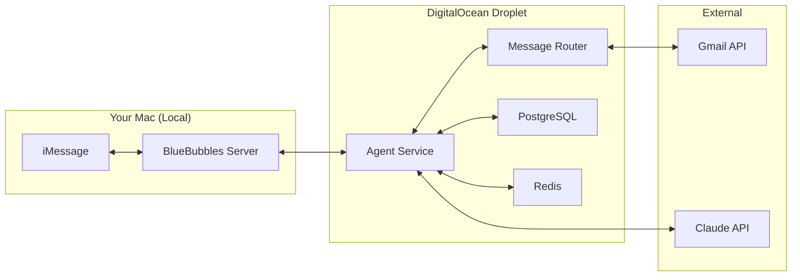
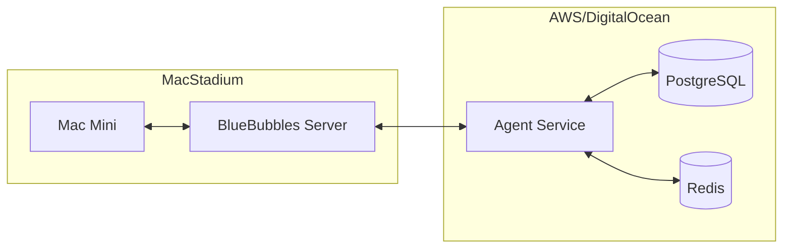

# Backend Hosting Analysis & Architecture Clarification

## ⚠️ CRITICAL CONSTRAINT
**BlueBubbles Server MUST run on a macOS device with iMessage**
- This cannot be hosted on cloud servers (AWS, DigitalOcean, etc.)
- Requires physical Mac or Mac cloud service (MacStadium, Mac mini colocation)
- This is the most complex infrastructure requirement

## Architecture Split

### 1. Mac-Based Components (MUST run on Mac)
```
Location: Your Mac / Mac Mini / MacStadium
```
- **BlueBubbles Server** - Direct iMessage access
- **AppleScript Execution** - Message sending
- **Chat.db Access** - iMessage database

### 2. Cloud-Hosted Components (Can run anywhere)
```
Location: DigitalOcean / AWS / Your preferred cloud
```
- **AI Agent Service** - Claude SDK integration
- **Message Router** - Channel coordination
- **Context Service** - Database and caching
- **Proactive Scheduler** - Job queues
- **Gmail Integration** - Email handling
- **Web API** - External interfaces

## Recommended Architecture

### Option 1: Hybrid Local + Cloud (Recommended for Development)


**Pros:**
- Low cost ($20-40/month for DigitalOcean)
- Full control over cloud components
- Easy development and debugging
- Mac can be your personal device

**Cons:**
- Mac must be always on
- Requires port forwarding or ngrok
- Single point of failure (your Mac)

### Option 2: Mac Cloud + Cloud Services (Production)


**Pros:**
- Professional hosting
- High availability
- Dedicated Mac hardware

**Cons:**
- Expensive ($140-200/month for Mac hosting)
- More complex setup
- Two hosting providers to manage

## Backend Hosting Comparison

### DigitalOcean (RECOMMENDED)
**Best for: Our cloud components**

**Pros:**
- Simple, predictable pricing
- Managed databases (PostgreSQL, Redis)
- Easy Kubernetes (if needed later)
- Good for WebSocket connections
- Droplet: $20/month (2GB RAM, 2 CPUs)
- Managed PostgreSQL: $15/month
- Managed Redis: $15/month
- **Total: ~$50/month**

**Setup:**
```bash
# Create Droplet
doctl compute droplet create bluebubbles-agent \
  --image ubuntu-22-04-x64 \
  --size s-2vcpu-2gb \
  --region nyc1

# Install Docker
ssh root@droplet-ip
apt update && apt install docker.io docker-compose
```

### AWS (Alternative)
**Pros:**
- Most features and services
- Can scale infinitely
- Good if you know AWS

**Cons:**
- Complex pricing
- Overkill for MVP
- Steeper learning curve

**Estimated Cost:**
- EC2 t3.small: $15/month
- RDS PostgreSQL: $15/month  
- ElastiCache Redis: $25/month
- **Total: ~$55/month + data transfer**

### Vercel/Netlify (NOT SUITABLE)
**Why not:**
- Serverless only (we need persistent WebSocket connections)
- Can't run background jobs
- No support for Bull queues
- Would require major architecture changes

## Complexity Analysis

### 🔴 Complex Parts (Need careful attention)

#### 1. BlueBubbles Integration
**Complexity: HIGH**
- Mac-only constraint
- Network connectivity between Mac and cloud
- Socket.io real-time connection maintenance
- Handling disconnections/reconnections

#### 2. Context Synchronization
**Complexity: HIGH**
- Cross-channel message correlation
- User identity linking (phone ↔ email)
- Conflict resolution
- Token optimization for Claude

#### 3. OAuth Implementation (without Auth0)
**Complexity: MEDIUM-HIGH**
- Must implement OAuth 2.0 flow manually
- Token refresh logic
- Secure storage
- Multiple providers (Google)

```typescript
// Manual OAuth implementation needed
class OAuthService {
  async getAuthorizationUrl(): string {
    return `https://accounts.google.com/o/oauth2/v2/auth?` +
      `client_id=${CLIENT_ID}&` +
      `redirect_uri=${REDIRECT_URI}&` +
      `scope=${SCOPES.join(' ')}&` +
      `response_type=code&` +
      `access_type=offline&` +
      `prompt=consent`;
  }
  
  async exchangeCodeForTokens(code: string): Promise<TokenSet> {
    // Implement token exchange
    // Handle refresh tokens
    // Secure storage
  }
}
```

#### 4. Proactive Messaging Timing
**Complexity: MEDIUM-HIGH**
- Natural language time parsing
- Timezone handling
- Recurring schedules
- Failure recovery

### 🟡 Moderate Complexity

#### 1. Gmail Integration
**Complexity: MEDIUM**
- Well-documented API
- Push notifications need setup
- Thread management logic

#### 2. Message Routing
**Complexity: MEDIUM**
- Channel abstraction layer
- Message normalization
- Error handling

#### 3. Database Design
**Complexity: MEDIUM**
- Schema design
- Indexing strategy
- Migration management

### 🟢 Straightforward Parts

#### 1. Claude Agent SDK Integration
**Complexity: LOW**
- Excellent SDK documentation
- Simple API calls
- Built-in context management

```typescript
// Straightforward Claude integration
const agent = new ClaudeAgent({
  apiKey: process.env.ANTHROPIC_API_KEY
});

const response = await agent.sendMessage(message);
```

#### 2. Bull Queue Setup
**Complexity: LOW**
- Well-documented
- Standard Redis backend
- Simple job scheduling

#### 3. Basic CRUD Operations
**Complexity: LOW**
- User management
- Preference storage
- Conversation history

#### 4. Docker Deployment
**Complexity: LOW**
- Standard containerization
- Docker Compose for local dev
- Simple deployment scripts

## Revised Implementation Strategy

### Phase 1: Local Development Setup
1. **Fork repositories** (not clone)
   ```bash
   # Fork via GitHub web interface, then:
   git clone https://github.com/YOUR-USERNAME/BlueBubbles-Server
   git clone https://github.com/YOUR-USERNAME/bluebubbles-app
   ```

2. **Local Mac setup**
   - Install BlueBubbles Server
   - Configure iMessage access
   - Test local connectivity

3. **Local services**
   ```yaml
   # docker-compose.yml for local dev
   version: '3.8'
   services:
     postgres:
       image: postgres:15
       ports:
         - "5432:5432"
     redis:
       image: redis:7
       ports:
         - "6379:6379"
   ```

### Phase 2: DigitalOcean Setup
1. **Create Droplet**
   - Ubuntu 22.04
   - 2GB RAM minimum
   - Install Docker

2. **Deploy services**
   ```bash
   # On DigitalOcean Droplet
   docker-compose up -d agent-service message-router
   ```

3. **Connect Mac to Droplet**
   - Use ngrok or SSH tunnel
   - Configure firewall rules
   - Test connectivity

### Phase 3: OAuth Implementation
Replace Auth0 with direct OAuth:

```typescript
// src/auth/GoogleOAuth.ts
import { OAuth2Client } from 'google-auth-library';

export class GoogleOAuth {
  private client: OAuth2Client;
  
  constructor() {
    this.client = new OAuth2Client(
      process.env.GOOGLE_CLIENT_ID,
      process.env.GOOGLE_CLIENT_SECRET,
      process.env.REDIRECT_URI
    );
  }
  
  async verifyIdToken(token: string) {
    const ticket = await this.client.verifyIdToken({
      idToken: token,
      audience: process.env.GOOGLE_CLIENT_ID
    });
    return ticket.getPayload();
  }
  
  async refreshAccessToken(refreshToken: string) {
    this.client.setCredentials({
      refresh_token: refreshToken
    });
    const { credentials } = await this.client.refreshAccessToken();
    return credentials;
  }
}
```

## Cost Breakdown

### Development Phase
- **Mac**: Your existing Mac ($0)
- **DigitalOcean Droplet**: $20/month
- **Managed PostgreSQL**: $15/month
- **Managed Redis**: $15/month
- **Claude API**: $50-100/month (development usage)
- **Total**: ~$100-150/month

### Production Phase
- **MacStadium Mac Mini**: $140/month
- **DigitalOcean Services**: $50/month
- **Claude API**: $200-500/month (production usage)
- **Monitoring/Backups**: $20/month
- **Total**: ~$410-710/month

## Key Decisions Made

1. **Backend**: DigitalOcean for cloud components (not Vercel/Netlify)
2. **Mac Hosting**: Local for dev, MacStadium for production
3. **OAuth**: Direct implementation, not Auth0
4. **Database**: DigitalOcean managed PostgreSQL + Redis
5. **Architecture**: Hybrid (Mac + Cloud) not fully cloud

## Action Items

1. ✅ Fork BlueBubbles repos (via GitHub web interface)
2. ✅ Choose DigitalOcean for cloud hosting
3. ✅ Plan for hybrid Mac + Cloud architecture
4. ✅ Implement direct OAuth instead of Auth0
5. ✅ Identify complex parts requiring extra attention
