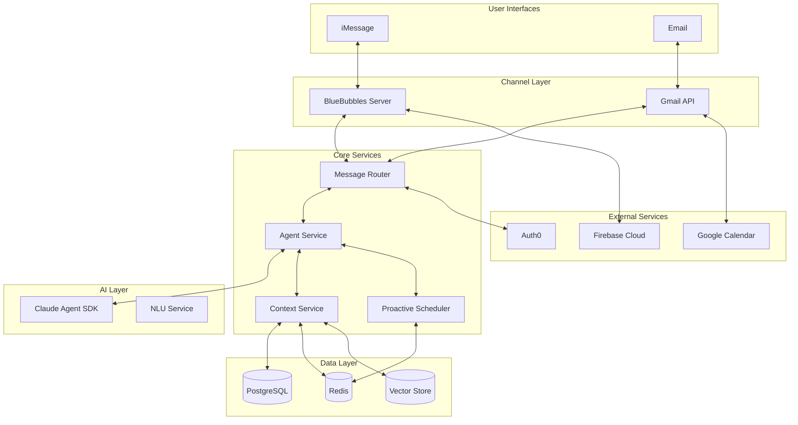
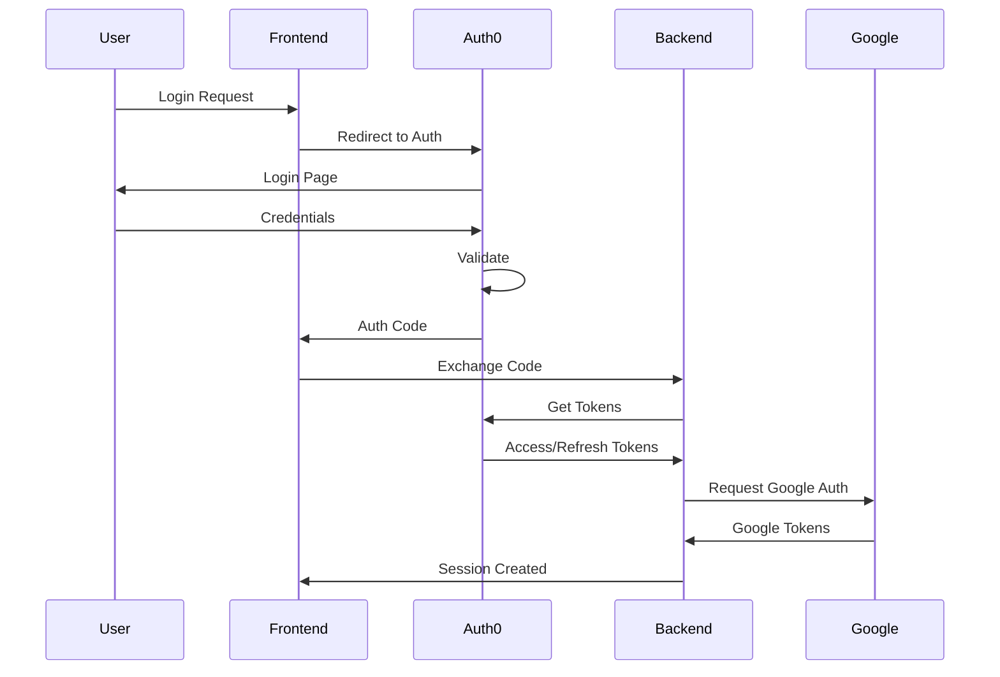

# System Architecture Design

## Executive Summary
A unified AI assistant system that seamlessly integrates iMessage (via BlueBubbles) and email communications, powered by Claude Agent SDK, with persistent context across channels and proactive messaging capabilities.

## System Overview

### Core Principles
1. **Channel Agnostic**: Unified experience across iMessage and email
2. **Context Persistent**: Maintains conversation state across all interactions
3. **Proactive**: Initiates helpful interactions based on context and schedule
4. **Scalable**: Designed for future channel additions and feature expansion
5. **Secure**: End-to-end security with encrypted storage and transmission

## High-Level Architecture



## Component Architecture

### 1. Channel Integration Layer

#### BlueBubbles Integration
```typescript
interface BlueBubblesIntegration {
  // Connection management
  connect(): Promise<void>;
  disconnect(): Promise<void>;
  
  // Message operations
  sendMessage(chat: string, message: string): Promise<MessageResult>;
  getMessages(chat: string, limit?: number): Promise<Message[]>;
  
  // Event listeners
  onMessage(callback: MessageHandler): void;
  onTypingIndicator(callback: TypingHandler): void;
  onReadReceipt(callback: ReadReceiptHandler): void;
  
  // Chat management
  createChat(participants: string[]): Promise<Chat>;
  getChats(): Promise<Chat[]>;
}
```

#### Gmail Integration
```typescript
interface GmailIntegration {
  // Authentication
  authenticate(tokens: TokenSet): Promise<void>;
  refreshTokens(): Promise<TokenSet>;
  
  // Email operations
  sendEmail(to: string, subject: string, body: string): Promise<EmailResult>;
  getInbox(query?: string): Promise<Email[]>;
  
  // Monitoring
  watchInbox(callback: EmailHandler): Promise<void>;
  stopWatch(): Promise<void>;
  
  // Thread management
  getThread(threadId: string): Promise<EmailThread>;
  replyToThread(threadId: string, message: string): Promise<EmailResult>;
}
```

### 2. Core Services Architecture

#### Agent Service
```typescript
class AgentService {
  private claude: ClaudeAgent;
  private context: ContextManager;
  private router: MessageRouter;
  private tools: ToolRegistry;
  
  // Message processing pipeline
  async processMessage(input: UnifiedMessage): Promise<AgentResponse> {
    // 1. Load context
    const context = await this.context.load(input.userId);
    
    // 2. Enhance with metadata
    const enhanced = this.enhanceWithMetadata(input, context);
    
    // 3. Process with Claude
    const response = await this.claude.chat(enhanced);
    
    // 4. Execute any tool calls
    const toolResults = await this.executeTools(response.toolCalls);
    
    // 5. Generate final response
    const final = await this.generateFinalResponse(response, toolResults);
    
    // 6. Update context
    await this.context.update(input.userId, final);
    
    // 7. Route response
    await this.router.send(input.channel, final);
    
    return final;
  }
}
```

#### Context Service Architecture
```typescript
class ContextService {
  private layers: {
    working: RedisCache;      // L1: Active conversations
    session: PostgreSQL;       // L2: Recent history
    longterm: VectorStore;     // L3: Persistent memory
  };
  
  async loadContext(userId: string): Promise<UserContext> {
    // Parallel load from all layers
    const [working, session, longterm] = await Promise.all([
      this.layers.working.get(userId),
      this.layers.session.get(userId),
      this.layers.longterm.search(userId)
    ]);
    
    // Merge intelligently based on relevance
    return this.mergeContext(working, session, longterm);
  }
  
  private mergeContext(
    working: WorkingContext,
    session: SessionContext,
    longterm: LongTermContext
  ): UserContext {
    // Token-optimized merging strategy
    const tokenBudget = 8000;
    const reserved = 2000; // For response
    const available = tokenBudget - reserved;
    
    return {
      recent: this.selectRecent(working, available * 0.5),
      relevant: this.selectRelevant(session, available * 0.3),
      facts: this.selectFacts(longterm, available * 0.2)
    };
  }
}
```

### 3. Proactive System Architecture

#### Scheduler Service
```typescript
class ProactiveScheduler {
  private queues: {
    high: BullQueue;    // Urgent reminders
    medium: BullQueue;  // Normal reminders
    low: BullQueue;     // Suggestions
  };
  
  async schedule(task: ProactiveTask): Promise<string> {
    const queue = this.selectQueue(task.priority);
    
    const job = await queue.add(task.type, {
      userId: task.userId,
      channel: task.channel,
      payload: task.payload,
      context: task.context
    }, {
      delay: task.scheduledFor - Date.now(),
      repeat: task.recurrence,
      attempts: 3,
      backoff: { type: 'exponential', delay: 2000 }
    });
    
    return job.id;
  }
  
  private setupProcessors() {
    // Process each queue with different concurrency
    this.queues.high.process(5, this.processHighPriority);
    this.queues.medium.process(3, this.processMediumPriority);
    this.queues.low.process(1, this.processLowPriority);
  }
}
```

## Data Models

### User Model
```typescript
interface User {
  id: string;
  identities: {
    email?: string;
    phone?: string;
    auth0Id?: string;
  };
  preferences: {
    timezone: string;
    language: string;
    communicationStyle: 'formal' | 'casual' | 'technical';
    channels: {
      preferred: ChannelType;
      quietHours: TimeRange;
    };
  };
  metadata: {
    createdAt: Date;
    lastActiveAt: Date;
    totalMessages: number;
  };
}
```

### Message Model
```typescript
interface UnifiedMessage {
  id: string;
  userId: string;
  channel: ChannelType;
  content: {
    text: string;
    attachments?: Attachment[];
    metadata?: Record<string, any>;
  };
  context: {
    threadId?: string;
    replyTo?: string;
    mentions?: string[];
  };
  timestamps: {
    created: Date;
    delivered?: Date;
    read?: Date;
  };
}
```

### Context Model
```typescript
interface UserContext {
  userId: string;
  conversations: {
    recent: Message[];      // Last 20 messages
    summary: string;        // AI-generated summary
  };
  memory: {
    facts: Fact[];         // Important information
    preferences: Map<string, any>;
    reminders: Reminder[];
  };
  state: {
    activeTopics: string[];
    pendingTasks: Task[];
    lastInteraction: Date;
  };
}
```

## Security Architecture

### Authentication Flow


### Data Security
1. **Encryption at Rest**
   - PostgreSQL: Transparent Data Encryption (TDE)
   - Redis: AOF encryption
   - File storage: AES-256 encryption

2. **Encryption in Transit**
   - TLS 1.3 for all API connections
   - mTLS for service-to-service communication
   - Certificate pinning for mobile clients

3. **Token Management**
   - JWT with short expiration (15 minutes)
   - Refresh tokens with rotation
   - Secure storage in encrypted cookies

4. **Access Control**
   - RBAC with Auth0
   - User-scoped data access
   - API rate limiting per user

## Scalability Design

### Horizontal Scaling Strategy
```yaml
# Kubernetes Deployment Example
apiVersion: apps/v1
kind: Deployment
metadata:
  name: agent-service
spec:
  replicas: 3  # Scale based on load
  selector:
    matchLabels:
      app: agent-service
  template:
    spec:
      containers:
      - name: agent
        image: bluebubbles-agent:latest
        resources:
          requests:
            memory: "512Mi"
            cpu: "500m"
          limits:
            memory: "1Gi"
            cpu: "1000m"
        env:
        - name: REDIS_CLUSTER
          value: "redis-cluster:6379"
        - name: PG_POOL_SIZE
          value: "20"
```

### Load Balancing
1. **Message Router**: Round-robin with sticky sessions
2. **Agent Service**: Least-connections algorithm
3. **Database**: Read replicas with pgpool
4. **Cache**: Redis Cluster with consistent hashing

### Performance Targets
- Message Processing: < 500ms p50, < 2s p99
- Context Loading: < 100ms p50, < 500ms p99
- Proactive Delivery: Within 1 minute of scheduled time
- Concurrent Users: 10,000 active sessions
- Message Throughput: 1,000 messages/second

## Monitoring & Observability

### Metrics Stack
```typescript
interface SystemMetrics {
  // Business Metrics
  messagesProcessed: Counter;
  activeUsers: Gauge;
  remindersSent: Counter;
  contextSyncLatency: Histogram;
  
  // Technical Metrics
  apiLatency: Histogram;
  errorRate: Counter;
  queueDepth: Gauge;
  cacheHitRate: Gauge;
  
  // Resource Metrics
  cpuUsage: Gauge;
  memoryUsage: Gauge;
  databaseConnections: Gauge;
  redisOperations: Counter;
}
```

### Logging Architecture
```typescript
class StructuredLogger {
  private formatters = {
    message: this.formatMessage,
    error: this.formatError,
    metric: this.formatMetric
  };
  
  log(level: LogLevel, event: LogEvent) {
    const structured = {
      timestamp: new Date().toISOString(),
      level,
      service: this.serviceName,
      traceId: this.getTraceId(),
      userId: event.userId,
      ...this.formatters[event.type](event)
    };
    
    this.output.write(JSON.stringify(structured));
  }
}
```

### Alerting Rules
1. **Critical Alerts**
   - Service down > 1 minute
   - Error rate > 5%
   - Database connection pool exhausted
   - Authentication service unavailable

2. **Warning Alerts**
   - Queue depth > 1000 messages
   - Response time p99 > 5s
   - Cache miss rate > 50%
   - Failed delivery rate > 10%

## Deployment Architecture

### Container Strategy
```dockerfile
# Multi-stage build for Agent Service
FROM node:18-alpine AS builder
WORKDIR /app
COPY package*.json ./
RUN npm ci --only=production

FROM node:18-alpine
WORKDIR /app
COPY --from=builder /app/node_modules ./node_modules
COPY . .
EXPOSE 3000
USER node
CMD ["node", "dist/index.js"]
```

### Infrastructure as Code
```terraform
# Example Terraform for AWS deployment
resource "aws_ecs_service" "agent_service" {
  name            = "bluebubbles-agent"
  cluster         = aws_ecs_cluster.main.id
  task_definition = aws_ecs_task_definition.agent.arn
  desired_count   = 3
  
  load_balancer {
    target_group_arn = aws_lb_target_group.agent.arn
    container_name   = "agent"
    container_port   = 3000
  }
  
  auto_scaling {
    min_capacity = 2
    max_capacity = 10
    
    scale_up_policy {
      metric = "cpu"
      threshold = 70
    }
  }
}
```

## Disaster Recovery

### Backup Strategy
1. **Database**: Daily snapshots with 30-day retention
2. **Redis**: AOF with hourly snapshots
3. **Configuration**: Version controlled in Git
4. **Secrets**: Encrypted backups in separate region

### Recovery Procedures
1. **RTO Target**: 1 hour
2. **RPO Target**: 15 minutes
3. **Failover**: Automatic with health checks
4. **Data Recovery**: Point-in-time restoration

## Future Enhancements

### Phase 1 (Months 1-3)
- Core agent functionality
- Basic iMessage and email integration
- Simple reminder system
- Context persistence

### Phase 2 (Months 4-6)
- Google Calendar integration
- Advanced proactive messaging
- ML-based personalization
- Multi-user support

### Phase 3 (Months 7-9)
- Additional channels (Slack, Teams)
- Voice interface
- Advanced analytics
- Plugin system

### Phase 4 (Months 10-12)
- Federated learning for privacy
- End-to-end encryption
- Self-hosted option
- Enterprise features
