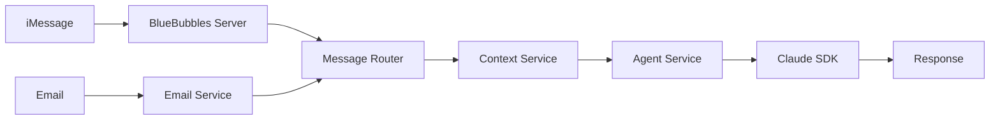
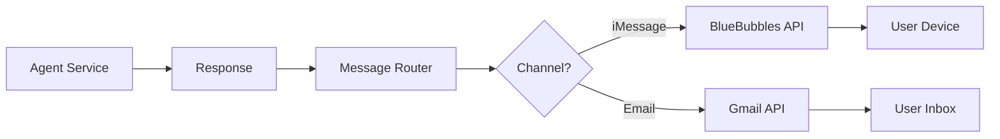

# Integration Architecture

## System Overview
A unified AI assistant that seamlessly operates across iMessage and email channels, maintaining consistent context and providing proactive assistance.

## Architecture Components

### 1. Core Services

#### Agent Service (Node.js/TypeScript)
```
Primary AI agent powered by Claude Agent SDK
- Message processing
- Context management  
- Response generation
- Tool execution
```

#### Message Router Service
```
Channel-agnostic message handling
- Channel abstraction
- Message normalization
- Response routing
- Delivery confirmation
```

#### Context Service
```
Unified state management
- User identification
- Conversation history
- Preference storage
- Cross-channel sync
```

#### Scheduler Service
```
Proactive messaging engine
- Reminder queue
- Scheduled tasks
- Calendar sync
- Event triggers
```

### 2. Channel Integrations

#### iMessage Integration
```
BlueBubbles Server Connection
- Socket.io client
- Message listener
- Send message API
- Attachment handling
```

#### Email Integration
```
Google Workspace Connection
- Gmail API/IMAP
- Inbox monitoring
- Send/receive emails
- Thread management
```

## Data Flow Architecture

### Inbound Message Flow


### Outbound Message Flow


## Detailed Component Design

### 1. Agent Service Architecture
```typescript
class AgentService {
  private claudeAgent: ClaudeAgent;
  private contextManager: ContextManager;
  private toolRegistry: ToolRegistry;
  
  constructor() {
    this.claudeAgent = new ClaudeAgent({
      apiKey: process.env.ANTHROPIC_API_KEY,
      systemPrompt: this.loadSystemPrompt(),
      settingSources: ['project'],
      tools: this.registerTools()
    });
  }
  
  async processMessage(
    userId: string,
    message: string,
    channel: ChannelType,
    metadata: MessageMetadata
  ): Promise<AgentResponse> {
    // Load user context
    const context = await this.contextManager.loadContext(userId);
    
    // Process with Claude
    const response = await this.claudeAgent.sendMessage(message, {
      context,
      metadata
    });
    
    // Save updated context
    await this.contextManager.saveContext(userId, response.context);
    
    return response;
  }
}
```

### 2. Message Router Design
```typescript
interface MessageRouter {
  // Inbound routing
  handleIncomingMessage(
    channel: ChannelType,
    message: IncomingMessage
  ): Promise<void>;
  
  // Outbound routing
  sendResponse(
    channel: ChannelType,
    recipient: string,
    response: AgentResponse
  ): Promise<void>;
  
  // Channel registration
  registerChannel(
    channel: ChannelType,
    handler: ChannelHandler
  ): void;
}

class UnifiedMessageRouter implements MessageRouter {
  private channels: Map<ChannelType, ChannelHandler>;
  private agentService: AgentService;
  
  async handleIncomingMessage(
    channel: ChannelType,
    message: IncomingMessage
  ) {
    // Normalize message
    const normalized = this.normalizeMessage(message);
    
    // Process with agent
    const response = await this.agentService.processMessage(
      normalized.userId,
      normalized.content,
      channel,
      normalized.metadata
    );
    
    // Route response
    await this.sendResponse(channel, message.sender, response);
  }
}
```

### 3. Context Management Strategy
```typescript
interface ContextStore {
  userId: string;
  conversations: Map<ChannelType, Conversation[]>;
  preferences: UserPreferences;
  reminders: Reminder[];
  calendarEvents: CalendarEvent[];
  lastActivity: Date;
  metadata: Record<string, any>;
}

class ContextManager {
  private db: Database;
  private cache: Redis;
  
  async loadContext(userId: string): Promise<ContextStore> {
    // Check cache first
    const cached = await this.cache.get(`context:${userId}`);
    if (cached) return cached;
    
    // Load from database
    const context = await this.db.getContext(userId);
    
    // Merge conversations from all channels
    context.conversations = await this.mergeChannelConversations(userId);
    
    // Cache for performance
    await this.cache.set(`context:${userId}`, context, { ttl: 300 });
    
    return context;
  }
  
  private async mergeChannelConversations(
    userId: string
  ): Promise<Map<ChannelType, Conversation[]>> {
    const conversations = new Map();
    
    // Get iMessage history
    conversations.set(
      ChannelType.IMESSAGE,
      await this.db.getConversations(userId, ChannelType.IMESSAGE)
    );
    
    // Get email history
    conversations.set(
      ChannelType.EMAIL,
      await this.db.getConversations(userId, ChannelType.EMAIL)
    );
    
    return conversations;
  }
}
```

### 4. Channel Handlers

#### iMessage Handler
```typescript
class IMessageHandler implements ChannelHandler {
  private bbClient: BlueBubblesClient;
  
  constructor() {
    this.bbClient = new BlueBubblesClient({
      serverUrl: process.env.BB_SERVER_URL,
      password: process.env.BB_PASSWORD
    });
    
    this.setupListeners();
  }
  
  private setupListeners() {
    this.bbClient.on('message', async (message) => {
      await this.router.handleIncomingMessage(
        ChannelType.IMESSAGE,
        this.transformMessage(message)
      );
    });
  }
  
  async sendMessage(recipient: string, content: string) {
    await this.bbClient.sendMessage({
      chatGuid: recipient,
      message: content
    });
  }
}
```

#### Email Handler
```typescript
class EmailHandler implements ChannelHandler {
  private gmail: GmailClient;
  private inbox: InboxMonitor;
  
  constructor() {
    this.gmail = new GmailClient({
      credentials: this.loadCredentials()
    });
    
    this.inbox = new InboxMonitor(this.gmail);
    this.setupMonitoring();
  }
  
  private setupMonitoring() {
    this.inbox.on('newMessage', async (email) => {
      await this.router.handleIncomingMessage(
        ChannelType.EMAIL,
        this.transformEmail(email)
      );
    });
  }
  
  async sendEmail(recipient: string, content: string, subject?: string) {
    await this.gmail.send({
      to: recipient,
      subject: subject || 'AI Assistant Response',
      body: content
    });
  }
}
```

## Database Schema

### Users Table
```sql
CREATE TABLE users (
  id UUID PRIMARY KEY,
  email VARCHAR(255),
  phone_number VARCHAR(20),
  created_at TIMESTAMP,
  updated_at TIMESTAMP,
  preferences JSONB
);
```

### Conversations Table
```sql
CREATE TABLE conversations (
  id UUID PRIMARY KEY,
  user_id UUID REFERENCES users(id),
  channel VARCHAR(50),
  message_id VARCHAR(255),
  content TEXT,
  is_from_user BOOLEAN,
  metadata JSONB,
  created_at TIMESTAMP
);
```

### Reminders Table
```sql
CREATE TABLE reminders (
  id UUID PRIMARY KEY,
  user_id UUID REFERENCES users(id),
  content TEXT,
  scheduled_for TIMESTAMP,
  channel VARCHAR(50),
  status VARCHAR(50),
  created_at TIMESTAMP
);
```

### Context Table
```sql
CREATE TABLE context (
  user_id UUID PRIMARY KEY REFERENCES users(id),
  context_data JSONB,
  last_updated TIMESTAMP
);
```

## Proactive Messaging Implementation

### Scheduler Service
```typescript
class SchedulerService {
  private queue: BullQueue;
  private agentService: AgentService;
  private router: MessageRouter;
  
  constructor() {
    this.queue = new BullQueue('reminders');
    this.setupWorkers();
  }
  
  async scheduleReminder(
    userId: string,
    channel: ChannelType,
    message: string,
    scheduledFor: Date
  ) {
    await this.queue.add('reminder', {
      userId,
      channel,
      message,
      scheduledFor
    }, {
      delay: scheduledFor.getTime() - Date.now()
    });
  }
  
  private setupWorkers() {
    this.queue.process('reminder', async (job) => {
      const { userId, channel, message } = job.data;
      
      // Generate reminder message with context
      const response = await this.agentService.generateReminder(
        userId,
        message
      );
      
      // Send via appropriate channel
      await this.router.sendResponse(channel, userId, response);
    });
  }
}
```

## Google Calendar Integration

### Calendar Service
```typescript
class CalendarService {
  private calendar: GoogleCalendar;
  private oauth: OAuth2Client;
  
  async syncUserCalendar(userId: string) {
    const events = await this.calendar.events.list({
      calendarId: 'primary',
      timeMin: new Date().toISOString(),
      maxResults: 50,
      singleEvents: true,
      orderBy: 'startTime'
    });
    
    // Store in context
    await this.contextManager.updateCalendarEvents(userId, events);
    
    // Schedule reminders for events
    for (const event of events) {
      await this.schedulerService.scheduleEventReminder(
        userId,
        event
      );
    }
  }
}
```

## Security Considerations

### Authentication
- OAuth 2.0 for Google services
- Token-based auth for BlueBubbles
- API key management for Claude
- User verification across channels

### Data Protection
- Encryption at rest (database)
- Encryption in transit (TLS)
- PII handling compliance
- Message retention policies

### Rate Limiting
- Claude API rate limits
- iMessage sending limits
- Gmail API quotas
- Internal rate limiting

## Deployment Architecture

### Container Setup
```yaml
version: '3.8'
services:
  agent-service:
    build: ./agent
    environment:
      - ANTHROPIC_API_KEY=${ANTHROPIC_API_KEY}
      - DATABASE_URL=${DATABASE_URL}
    depends_on:
      - postgres
      - redis
  
  message-router:
    build: ./router
    depends_on:
      - agent-service
  
  scheduler:
    build: ./scheduler
    depends_on:
      - redis
      - postgres
  
  postgres:
    image: postgres:15
    volumes:
      - postgres_data:/var/lib/postgresql/data
  
  redis:
    image: redis:7
```

### Scaling Strategy
1. Horizontal scaling of agent service
2. Message queue for async processing
3. Redis for caching and session storage
4. Load balancing for high availability

## Monitoring & Observability

### Metrics
- Message processing time
- Response latency
- Channel availability
- Error rates
- Context cache hit ratio

### Logging
- Structured logging (JSON)
- Request/response tracking
- Error aggregation
- Audit trail for messages

### Alerting
- Channel connection failures
- High error rates
- API limit warnings
- System health checks
